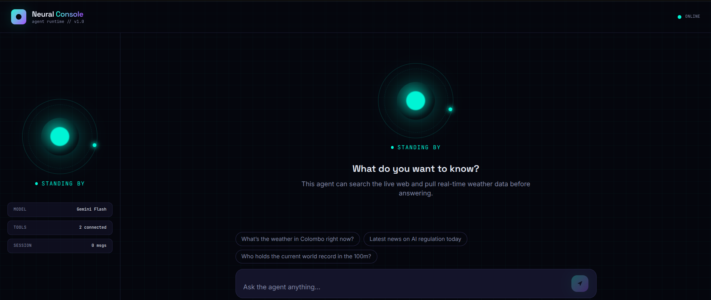
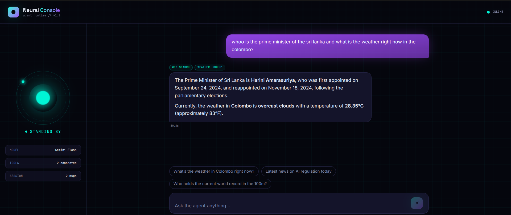

<div align="center">

# 🧠 Neural Console
### A conversational interface for an autonomous AI agent

*Real-time reasoning, live web search, and weather awareness — wrapped in a clean, animated chat UI.*


</div>

---

## What is this?

Most LangChain agent demos live and die inside a Jupyter cell. **Neural Console** takes the
same agent — reasoning over tools, pulling live data, answering in real time — and gives it
a real home: a FastAPI backend serving a React chat interface, so it's actually usable,
demoable, and shareable.

The agent can:
- 🔍 **Search the web** for current events and real-time information
- 🌦️ **Check live weather** for any city
- 🧩 **Reason step-by-step** before responding, showing which tools it used

Your original agent logic is untouched — the backend just wraps the same `create_agent`
setup, tools, and retry logic behind a clean `POST /api/chat` endpoint.

## Preview

<div align="center">

**Chat interface**



**Agent responding with visible tool usage**



</div>

## Architecture

```
agent-ui-project/
├── backend/     FastAPI wrapper around the agent  →  agent_server.py
└── frontend/    React + Vite + Tailwind + Framer Motion chat UI
```

```
 ┌────────────┐      POST /api/chat      ┌─────────────────┐      tool calls      ┌──────────────┐
 │  Frontend  │ ───────────────────────▶ │  FastAPI Server  │ ───────────────────▶ │  LangGraph    │
 │  (React)   │ ◀─────────────────────── │  (agent_server)  │ ◀─────────────────── │  Agent + LLM  │
 └────────────┘        response          └─────────────────┘      results          └──────┬───────┘
                                                                                            │
                                                                             ┌──────────────┼──────────────┐
                                                                             ▼                             ▼
                                                                       Tavily Search               OpenWeatherMap
```

## Getting started

### 1 · Backend

```bash
cd backend
python -m venv venv
source venv/bin/activate        # Windows: venv\Scripts\activate
pip install -r requirements.txt
cp .env.example .env            # fill in your real API keys
uvicorn agent_server:app --reload --port 8000
```

Verify it's running → `http://localhost:8000/api/health` should return `{"status":"ok"}`.

### 2 · Frontend

```bash
cd frontend
npm install
cp .env.example .env            # VITE_API_URL=http://localhost:8000
npm run dev
```

Open the URL Vite prints — usually `http://localhost:5173`.

### 3 · Using it

Type a message and hit **Enter** (Shift+Enter for a new line). The center orb pulses while
the agent reasons, and any tools it used — web search, weather lookup — appear as tags
above the reply.

## Roadmap / production notes

| Area | Current state | For production |
|---|---|---|
| **CORS** | Wide open (`allow_origins=["*"]`) | Lock to your real frontend domain |
| **Streaming** | Request/response only | Wire `agent.stream(...)` into SSE or WebSocket |
| **Sessions** | Stateless — full history resent each call | Persist sessions server-side (Redis/DB) |
| **Secrets** | `.env` files, gitignored | Use a secrets manager in deployment |

## Tech stack

**Backend:** Python · FastAPI · LangChain · LangGraph · Google Gemini · Tavily · OpenWeatherMap
**Frontend:** React · Vite · Tailwind CSS · Framer Motion

---

<div align="center">

**Kaveesha Madhushan**
Computer Engineering · University of Peradeniya

</div>